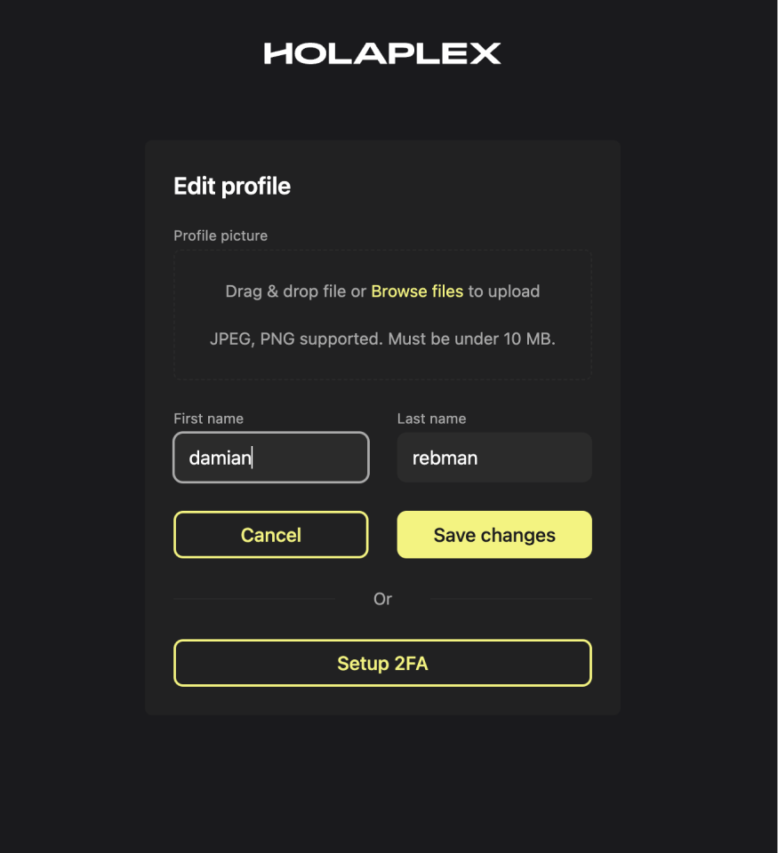
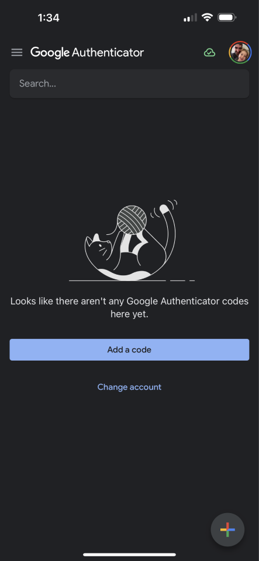
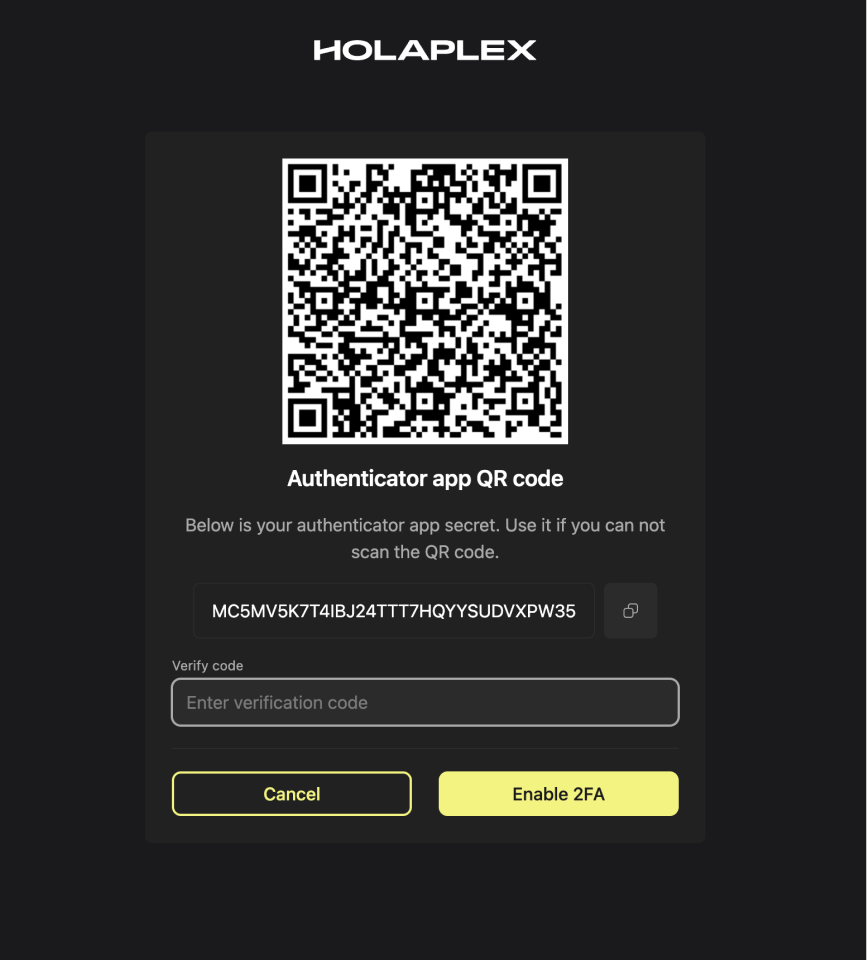
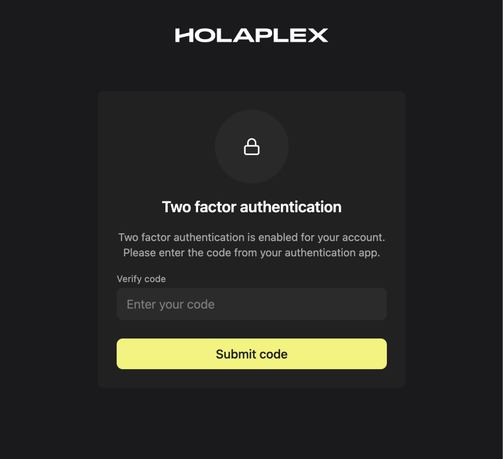

# Two-Factor Authentication

Setting up two-factor authentication (2FA) is an effective way to enhance the security of your account. Follow the steps below to set it up:

1. Log in to your Hub account and click on your name in the lower left corner of the screen. 
2. Select “edit profile” then click “Setup 2fa”
    
3. If you have an authenticator app installed on your mobile device move on to the next step, otherwise install one, we suggest Google Authenticator which you can get from the links below:
    1. Android: [https://play.google.com/store/apps/details?id=com.google.android.apps.authenticator2&hl=en](https://play.google.com/store/apps/details?id=com.google.android.apps.authenticator2&hl=en)
    2. Apple iOS: [https://apps.apple.com/us/app/google-authenticator/id388497605](https://apps.apple.com/us/app/google-authenticator/id388497605)
    
4. Open Google authenticator and press the plus button in lower right corner and scan the displayed QR code
    
5. Input the current code displayed in the Authenticator app
6. 2fa has now been set up!
7. Next time you log in you will be prompted for the current auth code from the authenticator app. Enter it and you’re in!
    