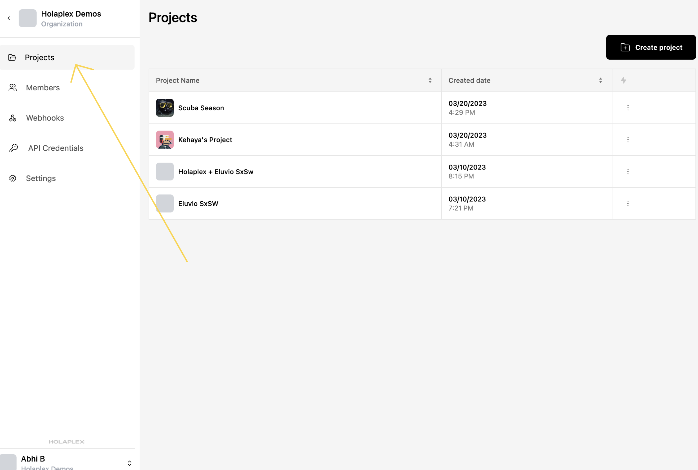

Creating a Project
==================

Introduction
------------

Once you've signed up and created an organization, the next step is to create a Project. Think of Projects as a way to organize your campaigns and ideas.

Once you've created a project, you can create drops within each project, set up unique experiences leveraging these drops, fund and manage your project treasury, or even delete the project when your job is done.

Creating a project is mandatory, and it shouldn't take you more than a few seconds to get one started.

Here's how to do it -

How to create a project
-----------------------

**Step 1**

Click on the "Projects" section in the sidebar on the left.

**Step 2**

If you haven't created a project before, this screen will be empty, showing only the "Create new project" button in the center. Click on that.

If you have created a project before, you'll find the "Create Project" button on the top-right of the screen as shown below.

**Step 3**

Give your project a name and attach your project logo. Don't worry, you can change these later as well.

**Step 4**

And you're done! You've created a project! That was fast, wasn't it? 
You should be able to see your project on your list of projects now -

You can always view the projects you've created by clicking on the Projects section on the left sidebar, as shown in Step 1.