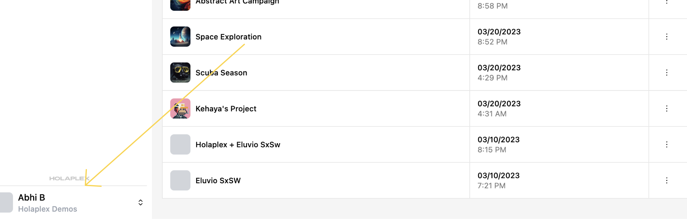

# Organizations

Organizations in Hub enable you and your team to create, manage and collaborate on projects more efficiently.

## Creating your first organization

When you first log into Hub, you'll be prompted to create an organization. You'll be awarded 1,000 credits to get your organization started.

Enter a unique and descriptive name for your organization and pick an appropriate logo. You can change these later.

## Creating an additional organization

1.  Log in to your Hub account.
2.  Click on your profile name located in the left sidebar menu.
    
3.  In the menu that pops up, click on the "Add Organization" button.
4.  You will be prompted to provide a name for your new organization. Enter a unique and descriptive name. Pick an appropriate logo.
5.  Click "Create Organization" to create your new organization.

## Joining an existing organization

If you've received an invite link, click to either create an account or sign in, after which you'll automatically be added to that organization.

## Managing your Organizations

### Editing your organization

Click on the settings icon beside your organization name to make changes to the organization's name or logo, or delete the organization altogether.

### Inviting team members

You can invite team members to your organization on the Members tab.

We're still configuring Hub's email server. For now, please use the Invite Link (found in the kebab menu) after adding an invitee's email address.

### Navigating between organizations

Once you've more than one organization, you can manage and switch between multiple organizations with ease. To do this:

1.  Click on your profile name in the left sidebar menu.
2.  In the menu that pops up, you'll see a list of your organizations. Click on the organization you want to switch to.
3.  You'll be redirected to the selected organization's dashboard.
