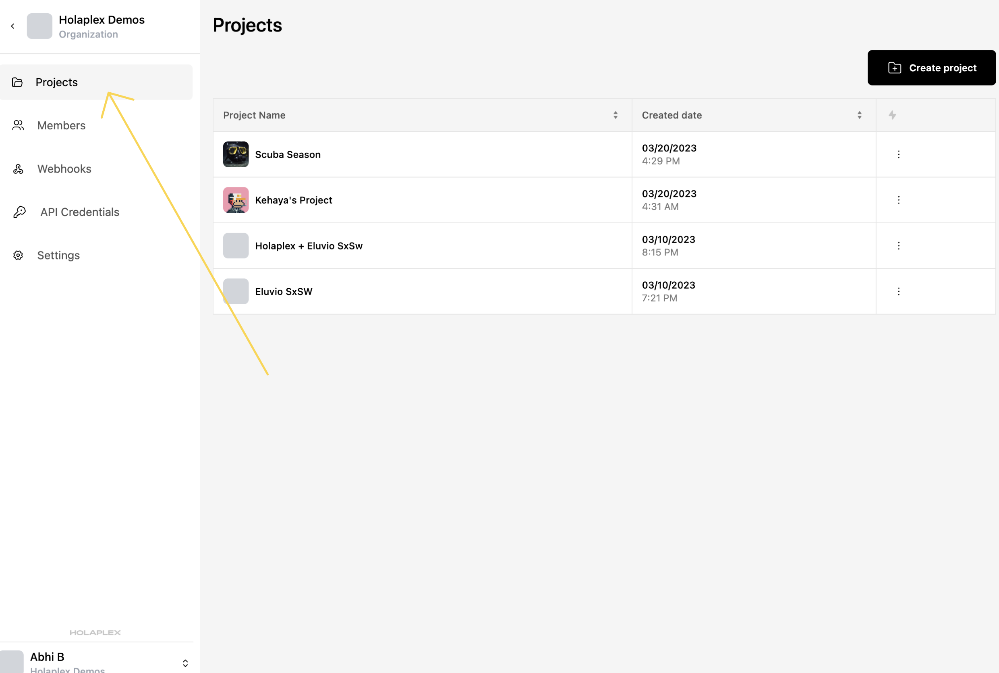
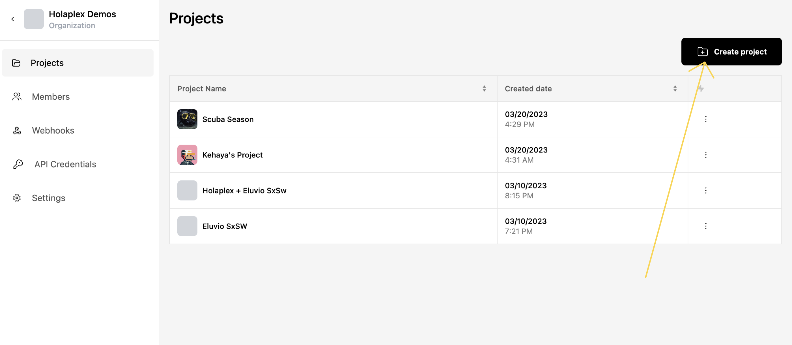

# Projects

Projects are a way to organize your campaigns and ideas within Hub. Projects are comprised of drops and each project is automatically assigned a new treasury wallet. This wallet is the default destination for royalties from drops created within that project, although the royalty structure and destination is fully customizable.

Once you've created a project, you can create drops within each project, set up unique experiences leveraging these drops, fund and manage your project treasury, or even delete a project when your job is done.

We leverage projects in our [scavenger hunt starter app](https://github.com/holaplex/hub-starter-scavenger). All drops within the configured project are included in the scavenger hunt.

## Creating a project

**Step 1**

From the organization where you'd like your project to live, click on the "Projects" section in the sidebar on the left.

**Step 2**

If you haven't created a project before, this screen will be empty, showing only the "Create new project" button in the center. Click on that.

If you have created a project before, you'll find the "Create Project" button on the top-right of the screen as shown below.

**Step 3**

Give your project a name and attach your project logo. You can change these later.

**Step 4**

Now your project will be visible on your list of projects now.

