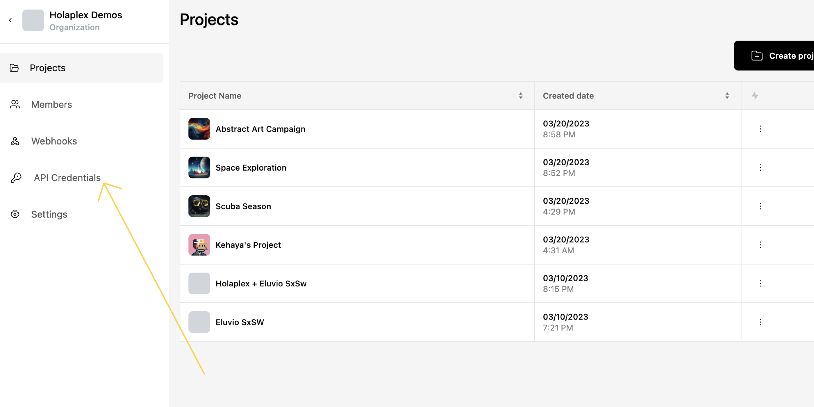

Creating API Credentials
============

Hub's APIs allows developers to build unique applications and integrate their existing applications with Hub. With extensive power to mint and deploy NFT campaigns across multiple blockchains, the possibilities with Hub's unified APIs are endless.

Once authenticated, developers can use the API to retrieve information about their projects, manage users, mint NFTs, create drops, get valuable information & insights about their customers, & manage their treasury.

In addition, Hub's unified APIs provide a flexible and scalable framework for developers to build custom integrations and automate their digital asset workflows. By leveraging the power of these APIs, developers can build unique experiences that leverages the best of Web3, without the friction and complexity that comes with it.

## Before you begin

To use Hub's APIs, developers must first obtain an API key by creating a Hub account and generating an API key. This API key is used to authenticate requests made to Hub and it should be kept securely. An API key, when in the wrong hands, can be especially dangerous, as bad actors can use your brand's name to deploy false projects & campaigns.

## Create API Keys

To create an API key, log in to your Hub account and navigate to the API Credentials section →

From there, you can generate a new API key and manage existing ones.

Make sure to keep your API key secure and not share it with anyone who should not have access to your Hub account. Once you have your API key, you can begin making requests to Hub's APIs.

[Here](/api) is the complete API reference for Hub's unified APIs, which includes detailed information about the available endpoints, request and response formats, and authentication requirements.