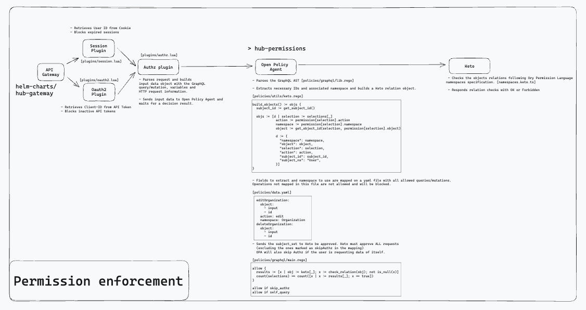
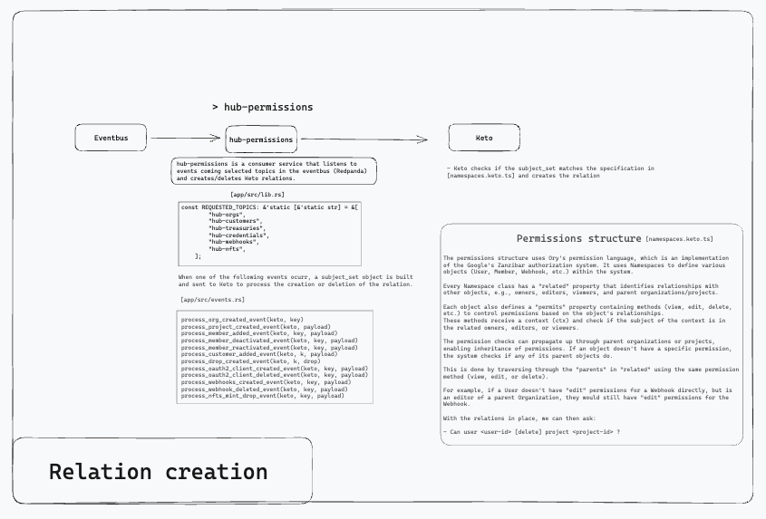

Architecture
============

Hub is a collection of loosely coupled microservices that emit and process messages through a shared Redpanda cluster, a Kafka compatible streaming data platform. The services also expose their own GraphQL API that are stitched together into a single API endpoint using Apollo Federated Router.

- [Hub Console](https://github.com/holaplex/hub) - User-friendly management console for interacting with the Hub API, built with Next.js and TypeScript. 

- [Hub NFTs](https://github.com/holaplex/hub-nfts) - Multi-chain minting and indexing of NFT campaigns. Leverages the Redpanda platform for inter-service communication. 

- [Hub Orgs](https://github.com/holaplex/hub-orgs) - Catalogue of all organizations, projects, and memberships for Hub.

- [Hub Treasuries](https://github.com/holaplex/hub-treasuries) - Creates crypto wallets using Fireblocks and submits blockchain transactions using Hub custodial wallets.

- [Hub Customers](https://github.com/holaplex/hub-customers) - Manages customer references that receive a treasury for storing crypto wallets.

- [Hub Permissions](https://github.com/holaplex/hub-permissions) - Contains all permission relationships for the Hub, leveraging Ory Keto for ACL, RBAC, and other access models.

- [Hub Identities](https://github.com/holaplex/hub-identities) - Manages all identities for Hub. Provides a GraphQL API for interacting with Ory Kratos, the identity server.

- [Hub Credentials](https://github.com/holaplex/hub-credentials) - Allows creation of API credentials for Hub. Provides a GraphQL API for interacting with Ory Hydra.

- [Hub Webhooks](https://github.com/holaplex/hub-webhooks) - Receives webhook events as Hub resources change, using Svix webhooks service.

- [Hub Credits](https://github.com/holaplex/hub-credits) - Allows users to pay for blockchain transactions and storage without needing tokens. Users can purchase credits using a credit card.

- [Hub Messages](https://github.com/holaplex/hub-messages) - Listens for events emitted by services and sends emails to users using Postmark when applicable. Leverages Redpanda for event processing.
